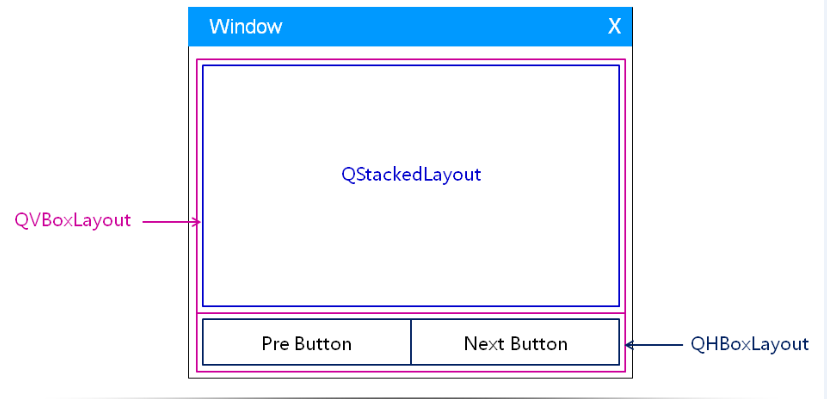
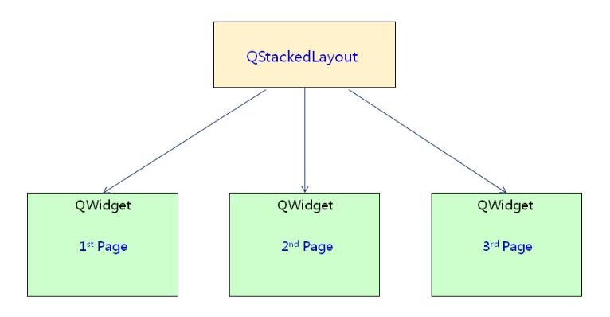
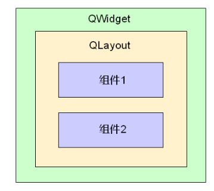
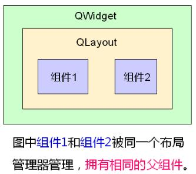

# 

# 

### 

# 1\. Demand analysis

1\. Practice developing a wizard user interface

(1) Display different wizard pages on the same interface

(2) Switch through the "Previous" and "Next" buttons

(3) The element components and element arrangement on different pages are different

(4) The components in the page are arranged through the layout manager

# Two, the solution

1\. Interface design through layout nesting

2\. Manage different pages through QStackedLayout

3\. Generate different ways through sub-components

4\. Matters needing attention

(1) Layout manager can be specified for any container component

(2) Components in the same layout manager have the same parent component

(3) The parent-child relationship is implicitly specified while the layout management is set

 Widget.h
    

1. #ifndef WIDGET_H
    

2. #define WIDGET_H
    

3. 4. #include <QtGui/QWidget>
    

5. #include <QLabel>
    

6. #include <QLineEdit>
    

7. #include <QPushButton>
    

8. #include <QStackedLayout>
    

9. 10. class Widget : public QWidget
    

11. {
    

12.  Q_OBJECT
    

13. private:
    

14.  QLabel label1;
    

15.  QLabel label2;
    

16.  QLabel label3;
    

17.  QLabel label4;
    

18.  QLineEdit edit;
    

19.  QPushButton pageBtn1;
    

20.  QPushButton pageBtn2;
    

21. 22.  QStackedLayout sLayout;//The definition is here for the convenience of the slot function
    

23. 24.  void initControl();
    

25.  QWidget* pageone();
    

26.  QWidget* pagetwo();
    

27.  QWidget* pagethree();
    

28. 29. private slots:
    

30.  void onPreBtnClicked();
    

31.  void onNextBtnClicked();
    

32. public:
    

33.  Widget(QWidget *parent = 0);
    

34.  ~Widget();
    

35. };
    

36. 37. #endif // WIDGET_H
    

38. 39. Widget.h
    
    

 Widget.cpp
    

1. #include "Widget.h"
    

2. #include <QHBoxLayout>
    

3. #include <QVBoxLayout>
    

4. #include <QPushButton>
    

5. #include <QFormLayout>
    

6. #include <QGridLayout>
    

7. #include <QDebug>
    

8. 9. Widget::Widget(QWidget *parent)
    

10.  : QWidget(parent)
    

11. {
    

12.  initControl();
    

13. }
    

14. void Widget::initControl()
    

15. {
    

16.  QHBoxLayout* hLayout = new QHBoxLayout();//1. Define the horizontal, vertical and stack manager of the main interface
    

17.  QVBoxLayout* vLayout = new QVBoxLayout();
    

18. 19. 20.  QPushButton* preBtn = new QPushButton();
    

21.  QPushButton* nextBtn = new QPushButton();
    

22.  preBtn->setText("pre page");
    

23.  nextBtn->setText("next page");
    

24.  preBtn->setMinimumSize(100,30);
    

25.  nextBtn->setMinimumSize(100,30);
    

26. 27.  hLayout->addWidget(preBtn);//3. Define the button and add it to the level manager
    

28.  hLayout->addWidget(nextBtn);
    

29. 30.  sLayout.addWidget(pageone());//5. Implement the page and add it to the stack manager
    

31.  sLayout.addWidget(pagetwo());
    

32.  sLayout.addWidget(pagethree());
    

33. 34.  vLayout->addLayout(&sLayout);//2. Add horizontal and stack manager to vertical manager
    

35.  vLayout->addLayout(hLayout);
    

36.  setLayout(vLayout);
    

37. 38.  connect(preBtn, SIGNAL(clicked()), this, SLOT(onPreBtnClicked()));//6.Connect signal and slot
    

39.  connect(nextBtn, SIGNAL(clicked()), this, SLOT(onNextBtnClicked()));
    

40. 41. 42. }
    

43. 44. QWidget* Widget::pageone()
    

45. {
    

46.  QWidget* ret = new QWidget;
    

47.  QGridLayout* glayout = new QGridLayout();
    

48. 49.  label1.setText("one");
    

50.  label2.setText("two");
    

51.  label3.setText("three");
    

52.  label4.setText("four");
    

53.  glayout->addWidget(&label1, 0, 0);
    

54.  glayout->addWidget(&label2, 0, 1);
    

55.  glayout->addWidget(&label3, 1, 0);
    

56.  glayout->addWidget(&label4, 1, 1);
    

57. 58.  ret->setLayout(glayout);
    

59.  /*Indicates that the components in the same layout manager have the same parent component
    

60.  qDebug() << ret;
    

61.  qDebug() << label1.parent();
    

62.  qDebug() << label2.parent();
    

63.  qDebug() << label3.parent();
    

64.  qDebug() << label4.parent();
    

65. */
    

66.  return ret;
    

67. }
    

68. QWidget* Widget::pagetwo()
    

69. {
    

70.  QWidget* ret = new QWidget;
    

71.  QFormLayout* flayout = new QFormLayout();
    

72. 73.  flayout->addRow("name:", &edit);
    

74.  ret->setLayout(flayout);
    

75. 76.  return ret;
    

77. }
    

78. QWidget* Widget::pagethree()
    

79. {
    

80.  QWidget* ret = new QWidget;
    

81. 82.  pageBtn1.setText("this is");
    

83.  pageBtn2.setText("a page");
    

84. 85.  QVBoxLayout* vlayout = new QVBoxLayout();
    

86.  vlayout->addWidget(&pageBtn1);
    

87.  vlayout->addWidget(&pageBtn2);
    

88. 89.  ret->setLayout(vlayout);
    

90. 91.  return ret;
    

92. }
    

93. void Widget::onPreBtnClicked()
    

94. {
    

95.  int index = ((sLayout.currentIndex() - 1) + sLayout.count()) % sLayout.count();
    

96.  sLayout.setCurrentIndex(index);
    

97. }
    

98. void Widget::onNextBtnClicked()
    

99. {
    

100.  int index = (sLayout.currentIndex() + 1) % 3;
    

101.  sLayout.setCurrentIndex(index);
    

102. }
    

103. Widget::~Widget()
    

104. {
    

105. 106. }
    

107. Widget.cpp
    
    

 main.cpp
    

1. #include <QtGui/QApplication>
    

2. #include "Widget.h"
    

3. 4. int main(int argc, char *argv[])
    

5. {
    

6.  QApplication a(argc, argv);
    

7.  Widget w;
    

8.  w.show();
    

9. 10.  return a.exec();
    

11. }
    

12. main.cpp
    
    

# 2\. Summary

(1) The layout manager can be nested to form a complex user interface

(2) Layout manager can be set for any container component

(3) The components in the same layout manager have the same parent component

(4) The parent-child relationship between components is an important way of memory management in Qt