1. QPixmap tmpPix(pix.size());
    

2. tmpPix.fill(Qt::transparent);
    

3. QPainter p1(&tmpPix);
    

4. p1.setCompositionMode(QPainter::CompositionMode_Source);
    

5. p1.drawPixmap(0, 0, pix);
    

6. If (canBuild) / / can be built with a semi-transparent representation
    

7. {
    

8. 	 //200 for transparency, 0 for full transparency, and 255 for opacity
    

9.  p1.setCompositionMode(QPainter::CompositionMode_DestinationIn);
    

10. 	p1.fillRect(tmpPix.rect(), QColor(0, 0, 0, 200));
    

11. }
    

12.  Else / / can not be built with red translucent
    

13. {
    

14. 	p1.setCompositionMode(QPainter::CompositionMode_ColorBurn);
    

15. 	p1.fillRect(tmpPix.rect(), QColor(255, 100, 100, 200));
    

16. }
    

17. p1.end();
    

18. pix = tmpPix;
    

19. painter->drawPixmap(fzX1 - NODE_WIDTH + thisBuilding.x_draw, fzY1 + NODE_HEIGHT + thisBuilding.y_draw, pix);
    
    

First on the same paragraph of the online code, it will be seen, not so much time to write a post

CompositionMode\_DestinationIn

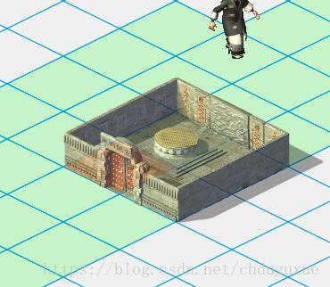

CompositionMode\_ColorBurn

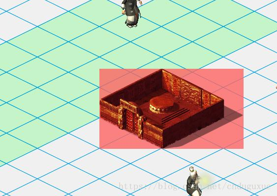

CompositionMode\_ColorDodge

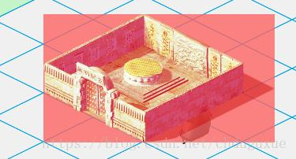

CompositionMode\_Darken

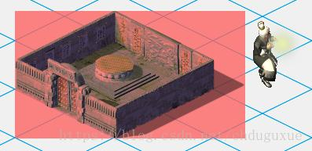

CompositionMode\_Destination

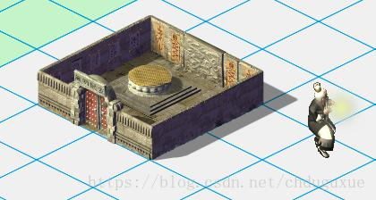

CompositionMode\_DestinationAtop

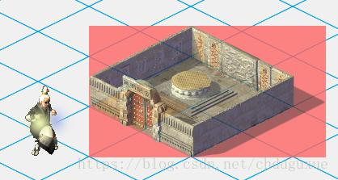

CompositionMode\_DestinationOut

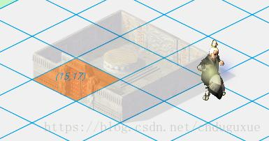

CompositionMode\_DestinationOver

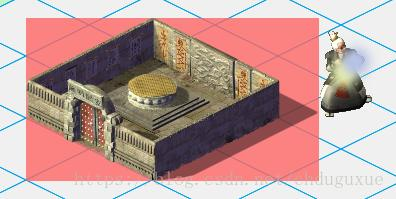

CompositionMode\_Difference

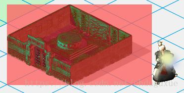

CompositionMode\_Exclusion

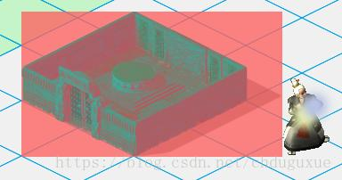

CompositionMode\_HardLight

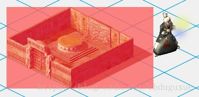

CompositionMode\_Lighten

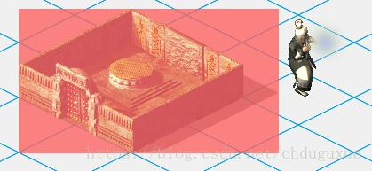

CompositionMode\_Multiply

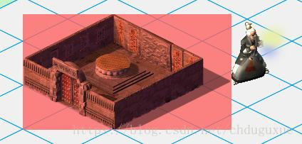

CompositionMode\_Overlay

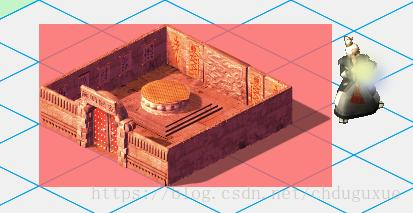

CompositionMode\_Plus

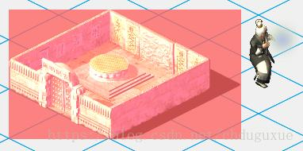

CompositionMode\_Screen

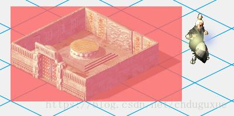

CompositionMode\_SoftLight

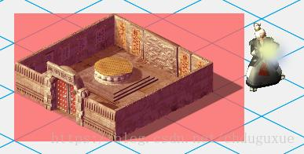

CompositionMode\_Source

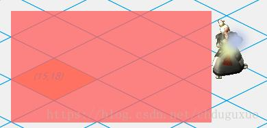

CompositionMode\_SourceAtop take the intersection

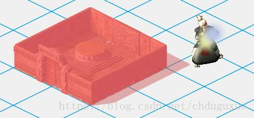

CompositionMode\_SourceIn 

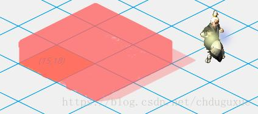

CompositionMode\_SourceOut This is directly hollowed out

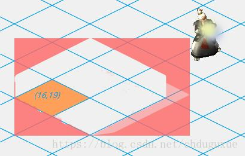

CompositionMode\_SourceOver

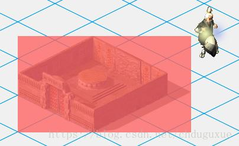

CompositionMode\_Xor 

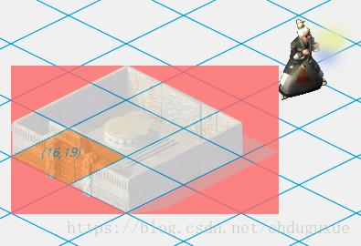

