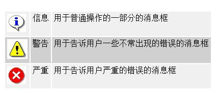
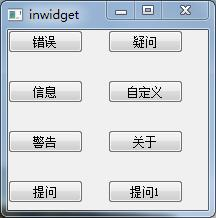
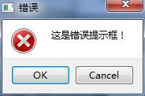
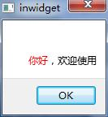
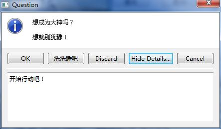

# 

## 

* Record here a simple interaction method that you often encounter when interacting in development. The standard dialog box provided by qt itself, its main function, can provide users with a short message, icon and some button modal Dialog box.

In the process of using, we can roughly divide the default standard dialog box into the following categories according to the severity:

Qt provides five types of interfaces for displaying such windows. The specific styles are as follows:

1、QMessageBox::critical(NULL, "critical", "Content", QMessageBox::Yes | QMessageBox::No, QMessageBox::Yes);

2、QMessageBox::warning(NULL, "warning", "Content", QMessageBox::Yes | QMessageBox::No, QMessageBox::Yes);

3、QMessageBox::question(NULL, "question", "Content", QMessageBox::Yes | QMessageBox::No, QMessageBox::Yes);

4、QMessageBox::about(NULL, "About", "About this application");

5\. The text information of the QMessageBox dialog box can support HTML tags. E.g:

QMessageBox::about(NULL, "About", "About this application</font\>");

6\. You can also set custom icons

Below is my routine

project files:

1. #-------------------------------------------------
    

2. #
    

3. # Project created by QtCreator 2018-01-14T15:03:03
    

4. #
    

5. #-------------------------------------------------
    

6. 7. QT += core gui
    

8. 9. greaterThan(QT_MAJOR_VERSION, 4): QT += widgets
    

10. 11. TARGET = inwidget
    

12. TEMPLATE = app
    

13. 14. 15. SOURCES += main.cpp\
    

16.  widget.cpp
    

17. 18. HEADERS += widget.h
    

19. 20.  #Use lamda expression to configure C++11
    

21. CONFIG += C++11 
    

22. 23. 

Widget.h:

1. #ifndef WIDGET_H
    

2. #define WIDGET_H
    

3. 4. #include <QWidget>
    

5. 6. 7. class Widget : public QWidget
    

8. {
    

9.  Q_OBJECT
    

10. 11. public:
    

12.  Widget(QWidget *parent = 0);
    

13.  ~Widget();
    

14. 15. public slots:
    

16.  void slotCriticalWidget();
    

17.  void slotWarningWidget();
    

18.  void slotQuestionWidget();
    

19.  void slotInfoWidget();
    

20.  void slotImageWidget();
    

21.  void slotDemoWidget();
    

22.  void slotDemoWidget1();
    

23. 24. 25. };
    

26. 27. #endif // WIDGET_H
    
    

Widget.cpp:

1. #include "widget.h"
    

2. #include <QPushButton>
    

3. #include <QMessageBox>
    

4. 5. Widget::Widget(QWidget *parent)
    

6.  : QWidget(parent)
    

7. {
    

8.  QPushButton *pBtnCritical = new QPushButton(this);
    

9.  QPushButton *pBtnWarning = new QPushButton(this);
    

10.  QPushButton *pBtnQuestion = new QPushButton(this);
    

11.  QPushButton *pBtnAbout = new QPushButton(this);
    

12.  QPushButton *pBtnInformation = new QPushButton(this);
    

13.  QPushButton *PBtnImage = new QPushButton(this);
    

14.  QPushButton *pBtnQuestion1 = new QPushButton(this);
    

15.  QPushButton *pBtnDemo = new QPushButton(this);
    

16. 17.  pBtnCritical->move(0,0);//Move position to position the button pBtnCritical to the coordinate (0,0)
    

18.  pBtnWarning->move(0,100);
    

19.  pBtnQuestion->move(100,0);
    

20.  pBtnAbout->move(100,100);
    

21.  pBtnInformation->move(0,50);
    

22.  PBtnImage->move(100,50);
    

23.  pBtnQuestion1->move(0, 150);
    

24.  pBtnDemo->move(100, 150);
    

25. 26. 27.  pBtnCritical->setText(QString("error"));
    

28.  pBtnWarning->setText(QString("Warning"));
    

29.  pBtnQuestion->setText(QString("question"));
    

30.  pBtnAbout->setText(QString("About"));
    

31.  pBtnInformation->setText(QString("information"));
    

32.  PBtnImage->setText(QString("Custom"));
    

33.  pBtnQuestion1->setText(QString("Question"));
    

34.  pBtnDemo->setText(QString("Question 1"));
    

35. 36. 37. 38.  connect(pBtnCritical, &QPushButton::clicked, this, &Widget::slotCriticalWidget);//The signal and slot mechanism in Qt5
    

39.  connect(pBtnWarning, SIGNAL(clicked()), this, SLOT(slotWarningWidget()));//The signal and slot mechanism in QT4, QT4 does not do parameter matching correction, even if there is no slot function, the compilation will be able to pass 
    

40.  connect(pBtnQuestion, &QPushButton::clicked, this, &Widget::slotQuestionWidget);
    

41.  connect(pBtnInformation, &QPushButton::clicked, this, &Widget::slotInfoWidget);
    

42.  connect(PBtnImage, &QPushButton::clicked, this, &Widget::slotImageWidget);
    

43.  connect(pBtnQuestion1, &QPushButton::clicked, this, &Widget::slotDemoWidget);
    

44.  connect(pBtnDemo, &QPushButton::clicked, this, &Widget::slotDemoWidget1);
    

45.  //Lamda expression
    

46.  connect(pBtnAbout, &QPushButton::clicked,
    

47.  [=]()
    

48.  {
    

49.  QMessageBox::about(NULL, QString(tr("About")), QString(tr("This is the About dialog box")));
    

50.  }
    

51.  );
    

52. 53. 54. }
    

55. 56. Widget::~Widget()
    

57. {
    

58. 59. }
    

60. 61. void Widget::slotCriticalWidget()
    

62. {
    

63.  QMessageBox *pMegBox = new QMessageBox(QString(tr("error")), QString(tr("this is an error message box!")),
    

64.  QMessageBox::Critical,//Here is the icon displayed in the message box
    

65.  QMessageBox::Ok | QMessageBox::Default,// Here is the button on the message box, the cursor is positioned by default
    

66.  QMessageBox::Cancel | QMessageBox::Escape, //This is combined with the escape key on the keyboard. When the user presses the key. The message box will execute the cancel key event
    

67.  0);// Define the third button here
    

68. // pMegBox->setAttribute(Qt::WA_DeleteOnClose, true);
    

69.  pMegBox->show();
    

70. 71. }
    

72. 73. void Widget::slotWarningWidget()
    

74. {
    

75.  QMessageBox::warning(this, QString(tr("Warning")), QString(tr("This is a warning dialog")), QMessageBox::Yes|QMessageBox::No);//Set the parent object to this, delete the object when the software is closed
    

76. }
    

77. 78. void Widget::slotQuestionWidget()
    

79. {
    

80.  switch(QMessageBox::question(this, QString(tr("question")), QString(tr("What is your gender?")), QString(tr("Male")), QString(tr(" " )), QString(tr(" ")), 0, 1))
    

81.  {
    

82.  case 0:
    

83.  break;
    

84.  case 1:
    

85.  break;
    

86.  case 2:
    

87.  break;
    

88.  default:
    

89.  break;
    

90.  }
    

91. 92. }
    

93. 94. void Widget::slotInfoWidget()
    

95. {
    

96.  QMessageBox* pMeg = new QMessageBox();
    

97.  pMeg->setInformativeText(QString(" Hello, welcome"));
    

98.  pMeg->setAttribute(Qt::WA_DeleteOnClose,true);
    

99.  pMeg->show();
    

100. }
    

101. 102. void Widget::slotImageWidget()
    

103. {
    

104.  QMessageBox message(QMessageBox::NoIcon, "Title", QString(tr("custom icon")));
    

105.  message.setIconPixmap(QPixmap("13.png"));
    

106.  message.exec();
    

107. }
    

108. 109. void Widget::slotDemoWidget()
    

110. {
    

111.  auto ret = QMessageBox::question(this, QString("question"), QString("Can you give me a hundred yuan?"),
    

112.  QMessageBox::Yes | QMessageBox::No | QMessageBox::Save,
    

113.  QMessageBox::No);
    

114. 115.  switch (ret) {
    

116.  case QMessageBox::Yes:
    

117.  break;
    

118.  case QMessageBox::No:
    

119.  break;
    

120.  case QMessageBox::Save:
    

121.  break;
    

122.  default:
    

123.  break;
    

124.  }
    

125. }
    

126. 127. 128. void Widget::slotDemoWidget1()
    

129. {
    

130.  QMessageBox msg(QMessageBox::Information, QString("Question"), QString("Do you want to be a great god?"));
    

131.  msg.setInformativeText(QString("Don't hesitate if you think!"));
    

132.  msg.setDetailedText(QString("Get started!"));//Adding detailed information will automatically add a button
    

133. 134.  msg.setStandardButtons(QMessageBox::Ok | QMessageBox::Discard | QMessageBox::Cancel);
    

135.  msg.setDefaultButton(QMessageBox::Ok);//Set the default button
    

136. 137.  QPushButton *Okbtn = new QPushButton(QObject::tr("wash and sleep"));
    

138.  msg.addButton(Okbtn, QMessageBox::AcceptRole);//Add custom buttons
    

139. 140.  auto ret = msg.exec();
    

141.  switch (ret) {
    

142.  case QMessageBox::Ok:
    

143.  break;
    

144. 145.  case QMessageBox::Discard:
    

146.  break;
    

147. 148.  case QMessageBox::Cancel:
    

149.  break;
    

150. 151.  case QMessageBox::AcceptRole:
    

152.  break;
    

153.  default:
    

154.  break;
    

155.  }
    

156. }
    

157. 158. 159. 160. 161. 162. 163. 164. 165. 

main.cpp:

1. #include "widget.h"
    

2. #include <QApplication>
    

3. 4. int main(int argc, char *argv[])
    

5. {
    

6.  QApplication a(argc, argv);
    

7.  Widget w;
    

8.  w.show();
    

9. 10.  return a.exec();
    

11. }
    
    

 

 