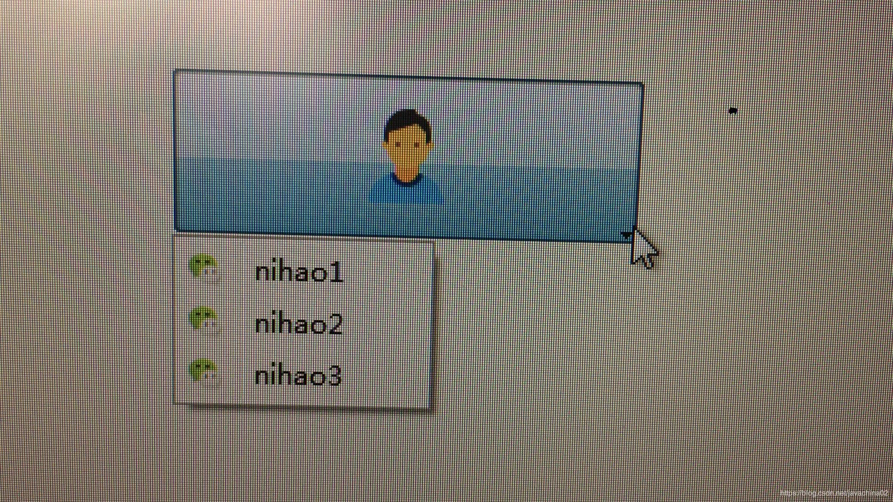

First, the source file  
//_widget.cpp_\*\*\*\*\*\*\*\*\*\*\*\*\*\*\*\*\*\*  
widget.cpp

\#include "widget.h"  
\#include "ui\_widget.h"  
\#include  
\#include  
\#include  
\#include  
Widget::Widget(QWidget \*parent) :  
QWidget(parent),  
ui(new Ui::Widget)  
{  
ui-\>setupUi(this);
    
    Ui->toolButton->setIcon(QIcon("../tool_button/User_48px.png"));//Button binding image Ui->toolButton->setIconSize(QSize(200,200)); //Set image size QMenu *menu = new QMenu(this); //New menu //"../tool_button/weget.png": image path; "nihao1": menu name; "nihao1()": execution function menu->addAction(QIcon("../tool_button/weget.png"),"nihao1",this,SLOT(nihao1())); menu->addAction(QIcon("../tool_button/weget.png"),"nihao2",this,SLOT(nihao2())); menu->addAction(QIcon("../tool_button/weget.png"),"nihao3",this,SLOT(nihao3())); Ui->toolButton->setPopupMode(QToolButton::InstantPopup); //Click mode Ui->toolButton->setMenu(menu); //dropdown menu 
    

* 1

* 2

* 3

* 4

* 5

* 6

* 7

* 8

* 9

* 10

* 11

}  
Widget::~Widget()  
{  
delete ui;  
}

void Widget::nihao1()  
{  
qDebug() << "nihao1" <<endl;  
}  
void Widget::nihao2()  
{  
qDebug() << "nihao2" <<endl;  
}  
void Widget::nihao3()  
{  
qDebug() << "nihao3" <<endl;  
}  
/widget.cpp end\*\*\*\*\*/  
/widget.h\*\*\*\*\*\*\*\*\*\*\*\*/  
\#ifndef WIDGET\_H  
\#define WIDGET\_H

\#include

namespace Ui {  
class Widget;  
}

class Widget : public QWidget  
{  
Q\_OBJECT

public:  
explicit Widget(QWidget \*parent = nullptr);  
~Widget();

private slots:  
void on\_toolButton\_triggered(QAction \*arg1);  
void nihao1();  
void nihao2();  
void nihao3();  
private:  
Ui::Widget \*ui;  
};

\#endif // WIDGET\_H  
/widget.h end\*\*\*\*\*/  
results  
