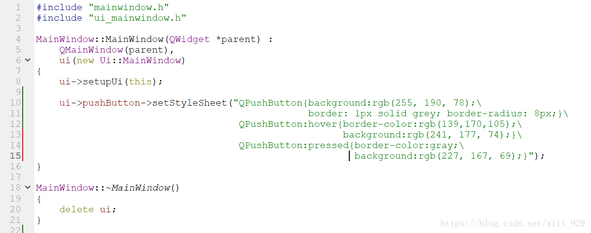
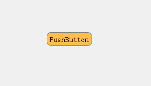
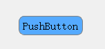
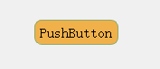

# 

There are other ways to change the style in the QT button:  
example:  
In mainwindow.cpp (name I am too lazy to change, use mainwindow), enter the mystery code to set the initial style of the button, the last "\\" line break for each line, do not want to use line breaks, The long screen of the screen can be integrated into one line of display.  
Setting the initial value input is the same as changing the style sheet directly in ui.  

    
    ui->pushButton->setStyleSheet("QPushButton{background:rgb(255, 190, 78);\ border: 1px solid grey; border-radius: 8px;}\ QPushButton:hover{border-color:rgb(139,170,105);\ background:rgb(241, 177, 74);}\ QPushButton:pressed{border-color:gray;background:rgb(227, 167, 69);}"); 
    

* 1

* 2

* 3

* 4

* 5

This is how it looks:  
  
still alright:  
Turns the pushbutton to the slot (clicked()), which becomes a different style after setting the point:
    
    void MainWindow::on_pushButton_clicked() { ui->pushButton->setStyleSheet("QPushButton{background:rgb(85, 170, 255);\ border: 1px solid grey; border-radius: 8px;}\ QPushButton:hover{border-color:rgb(139,170,105);\ background:rgb(81, 162, 243);}\ QPushButton:pressed{border-color:gray;\ background:rgb(75, 151, 227);}"); } 
    

* 1

* 2

* 3

* 4

* 5

* 6

* 7

* 8

* 9

Come again:
    
    void MainWindow::on_pushButton_clicked() { static int flag = 0; if(flag == 0) { flag = 1; ui->pushButton->setStyleSheet("QPushButton{background:rgb(85, 170, 255);\ border: 1px solid grey; border-radius: 8px;}\ QPushButton:hover{border-color:rgb(139,170,105);\ background:rgb(81, 162, 243);}\ QPushButton:pressed{border-color:gray;\ background:rgb(75, 151, 227);}"); } else { flag = 0; ui->pushButton->setStyleSheet("QPushButton{background:rgb(255, 190, 78);\ border: 1px solid grey; border-radius: 8px;}\ QPushButton:hover{border-color:rgb(139,170,105);\ background:rgb(241, 177, 74);}\ QPushButton:pressed{border-color:gray;\ background:rgb(227, 167, 69);}"); } } 
    

* 1

* 2

* 3

* 4

* 5

* 6

* 7

* 8

* 9

* 10

* 11

* 12

* 13

* 14

* 15

* 16

* 17

* 18

* 19

* 20

* 21

* 22

* 23

* 24

* 25

Set a flag, press to change the color, such as "blue when the button is closed, red when the button is closed", so play your own imagination and change the style.  
Note: Use static when setting the flag.

The above code diagram of the routine is as follows:  
  

(Lead Zhuo Education)