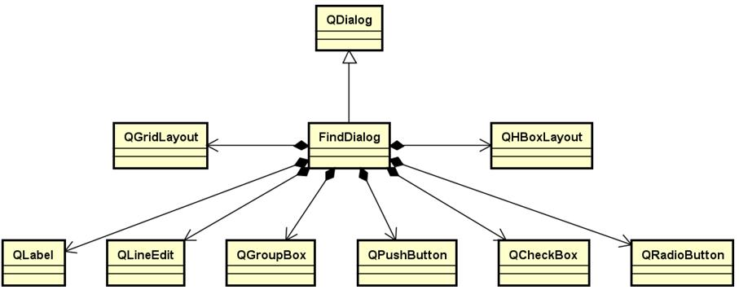
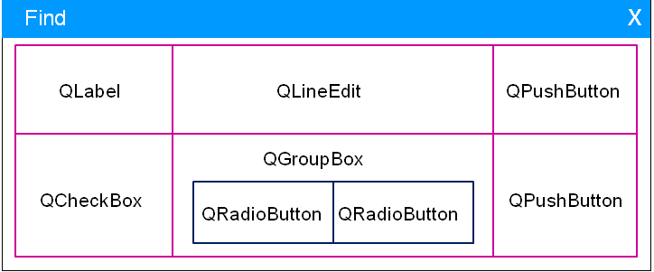

# 

## 

##### 

### 

1\. Find dialog

* Find dialog is a common part in the application  
Goal: develop a search dialog that can be reused between different projects
* Requirements analysis of the search dialog:  
--- reusable software parts  
--- Find the specified string in the text box  
--- Ability to specify the search direction  
--- supports case-sensitive search
* Additional requirements:  
--- hide after clicking the close button  
  
The architecture and design of the search dialog:  

* Interface layout of the search dialog  

summary:

* The search dialog can be developed as a reusable software component
* Find dialog inherits from QDialog class
* The interface of the search dialog is nested with each other through the layout manager
* The design and implementation of the search dialog is a classic example in GUI learning