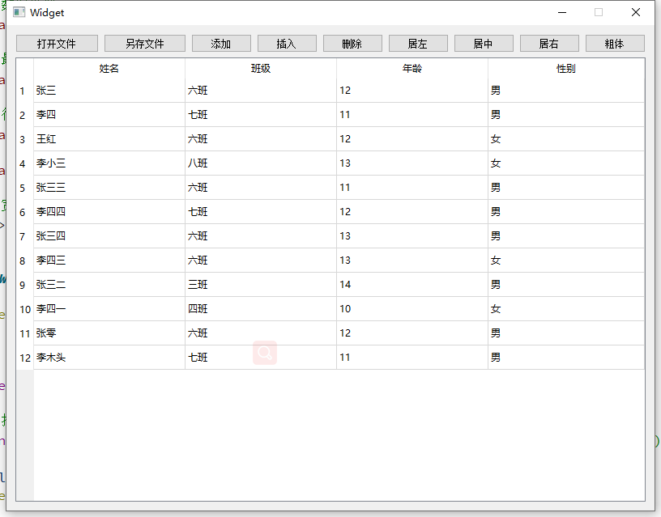
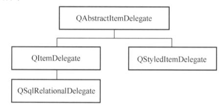
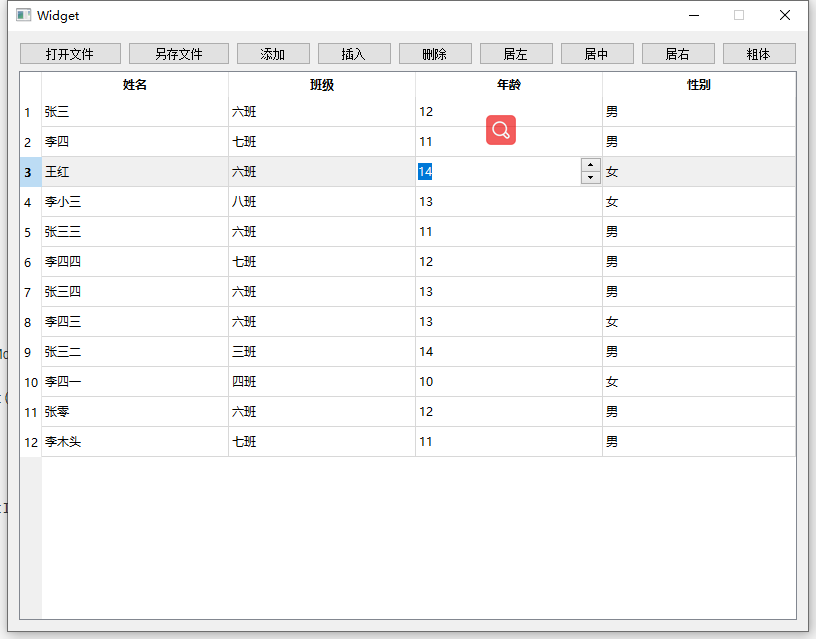

# 

## 

* ## Example

From the above figure, you can see age is an INT type, so you can use QspinBox as an editing component.

## Customize the basic design requirements of the agency class

QABSTractItemdeLegate is an abstract base class for all proxy classes.

QStylediteMdelegate is the default proxy class used by the view component, and QItemDelegate is also a similar function class.

QStyledItemdeLegate and QiteMdeLegate distinguish between QStyledItemDelegate can use the current style sheet setting to draw components, so it is recommended to use qstyleditemdelegate.

Also have to implement the following functions

* CreateEditor (): Create a Widget component used to edit model data, such as QspinBox, QComboBox.
* SetEditRData (): Get data from the data model for editing for Widget components.
* SetModeldata (): Update the data on the Widget to the data model.
* UpdateEditorGeometry (): It is used to set a suitable size to the Widget component.

### Custom agent based on QspinBox
    

1. //.h
    

2. #ifndef SPINBOXDELEGATE_H
    

3. #define SPINBOXDELEGATE_H
    

4. 5. #include <QStyledItemDelegate>
    

6. #include <QWidget>
    

7. #include <QModelIndex>
    

8. #include <QSpinBox>
    

9. 10. class SpinBoxDelegate : public QStyledItemDelegate
    

11. {
    

12.  Q_OBJECT
    

13. public:
    

14.  explicit SpinBoxDelegate(QObject *parent = nullptr);
    

15. 16.  QWidget *createEditor(QWidget *parent, const QStyleOptionViewItem &option, const QModelIndex &index) const;
    

17. 18.  void setEditorData(QWidget *editor, const QModelIndex &index) const;
    

19. 20.  void setModelData(QWidget *editor, QAbstractItemModel *model, const QModelIndex &index) const;
    

21. 22.  void updateEditorGeometry(QWidget *editor, const QStyleOptionViewItem &option, const QModelIndex &index) const;
    

23. };
    

24. 25. #endif // SPINBOXDELEGATE_H
    
    

1. //.cpp
    

2. #include "SpinBoxDelegate.h"
    

3. 4. SpinBoxDelegate::SpinBoxDelegate(QObject *parent) : QStyledItemDelegate(parent)
    

5. {
    

6. 7. }
    

8. 9. QWidget *SpinBoxDelegate::createEditor(QWidget *parent, const QStyleOptionViewItem &option, const QModelIndex &index) const
    

10. {
    

11.  QSpinBox *editor = new QSpinBox(parent);
    

12. 13.  // Set boundless box
    

14.  editor->setFrame(false);
    

15. 16.  // Set the minimum value
    

17.  editor->setMinimum(0);
    

18. 19.  // Set the maximum value
    

20.  editor->setMaximum(100);
    

21. 22.  //return
    

23.  return editor;
    

24. }
    

25. 26. void SpinBoxDelegate::setEditorData(QWidget *editor, const QModelIndex &index) const
    

27. {
    

28.  int value = index.model()->data(index,Qt::EditRole).toInt();
    

29.  QSpinBox *spinBox = static_cast<QSpinBox*>(editor);
    

30.  spinBox->setValue(value);
    

31. }
    

32. 33. void SpinBoxDelegate::setModelData(QWidget *editor, QAbstractItemModel *model, const QModelIndex &index) const
    

34. {
    

35.  QSpinBox *spinBox = static_cast<QSpinBox*>(editor);
    

36.  spinBox->interpretText();
    

37.  int value = spinBox->value();
    

38.  model->setData(index,value,Qt::EditRole);
    

39. }
    

40. 41. void SpinBoxDelegate::updateEditorGeometry(QWidget *editor, const QStyleOptionViewItem &option, const QModelIndex &index) const
    

42. {
    

43.  editor->setGeometry(option.rect);
    

44. }
    
    

use
    
    ui->tableView->setItemDelegateForColumn(2,&delegate);

operation result

## Complete source code

[https://download.csdn.net/download/wzz953200463/15453057](https://download.csdn.net/download/wzz953200463/15453057)