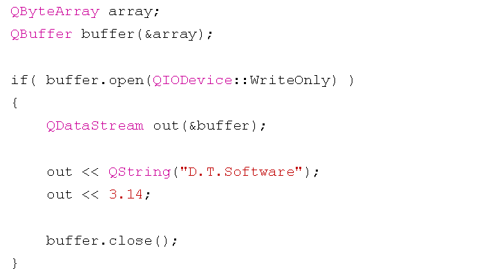
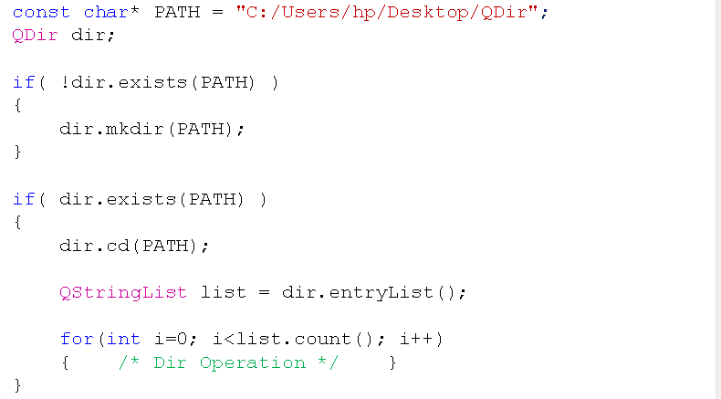
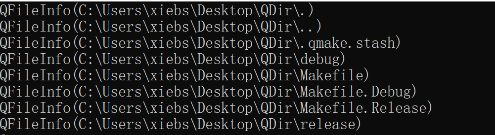
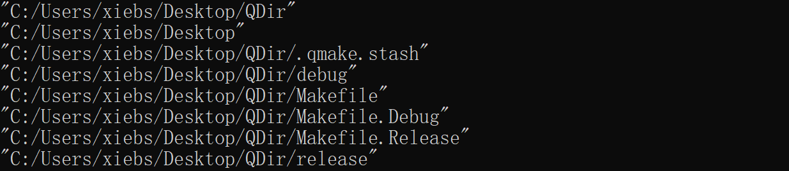
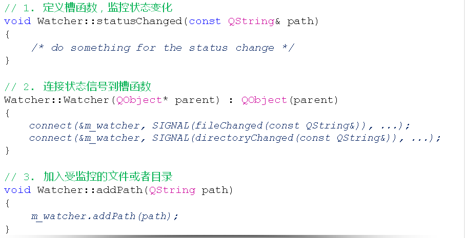
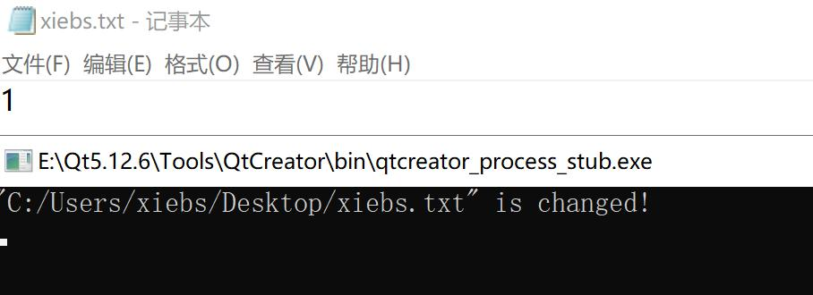

1\. Buffer operation

* The concept of buffers in Qt  
--- The essence of the buffer isA continuous storage space(The byte array represents continuous storage space)  
--- QBuffer is a buffer related class in Qt  
--- The buffer can be regarded as a special IO device in Qt  
--- The file stream auxiliary class can be directly used to manipulate the buffer
* How to use QBuffer buffer  

* QBuffer buffer usage occasions  
1\. Different types of data transfer between threads  
2\. Cache the data in the external device to return  
3\. Data reading speed is lower than data writing speed
    
    #include <QCoreApplication> #include <QByteArray> #include <QBuffer> #include <QDataStream> #include <QDebug> void write_buf(int type, QBuffer& buf) { if(buf.open(QIODevice::WriteOnly)) { QDataStream out(&buf); out << type; if(type == 0) { out << QString("D.T.Software"); out << QString("xiebs"); } else if(type == 1) { out << 3; out << 1415; } else if(type == 2) { out << 3.1415; } buf.close(); } } void read_buf(QBuffer& buf) { if(buf.open(QIODevice::ReadOnly)) { QDataStream in(&buf); int type = -1; in >> type; if(type == 0) { QString str1 = ""; QString str2 = ""; in >> str1; in >> str2; qDebug() << str1; qDebug() << str2; } else if(type == 1) { int a = 0; int b = 0; in >> a; in >> b; qDebug() << a; qDebug() << b; } else if(type == 2) { double value = 0; in >> value; qDebug() << value; } buf.close(); } } int main(int argc, char *argv[]) { QCoreApplication a(argc, argv); QByteArray array; QBuffer buf(&array); write_buf(1, buf); read_buf(buf); return a.exec(); 
    

* 1

* 2

* 3

* 4

* 5

* 6

* 7

* 8

* 9

* 10

* 11

* 12

* 13

* 14

* 15

* 16

* 17

* 18

* 19

* 20

* 21

* 22

* 23

* 24

* 25

* 26

* 27

* 28

* 29

* 30

* 31

* 32

* 33

* 34

* 35

* 36

* 37

* 38

* 39

* 40

* 41

* 42

* 43

* 44

* 45

* 46

* 47

* 48

* 49

* 50

* 51

* 52

* 53

* 54

* 55

* 56

* 57

* 58

* 59

* 60

* 61

* 62

* 63

* 64

* 65

* 66

* 67

* 68

* 69

* 70

* 71

* 72

* 73

* 74

* 75

* 76

* 77

* 78

* 79

* 80

2\. Directory operations

* QDir is a powerful directory operation class in Qt  
--- The directory separator in Qt is used uniformly`'/'`  
--- QDir can perform arbitrary operations on directories (create, delete, rename)  
--- QDir can get all entries (files and folders) in the directory  
--- QDir can use the filter string to get the specified item  
--- QDir can get all root directories in the system
* Basic example of directory operations  

    
    #include <QCoreApplication> #include <QDir> #include <QFileInfoList> #include <QDebug> void test_dir() { const char* path = "C:/Users/xiebs/Desktop/QDir"; QDir dir; if(!dir.exists(path)) { dir.mkdir(path); } if(dir.exists(path)) { dir.cd(path); QStringList list = dir.entryList(); for(int i = 0; i < list.count(); i++) { qDebug() << list[i]; } } } unsigned int calculate_size(QString PATH) { QFileInfo info(PATH); unsigned int ret = 0; if(info.isFile()) { ret = info.size(); } else if(info.isDir()) { QDir dir(PATH); QFileInfoList list = dir.entryInfoList(); for(int i = 0; i < list.count(); i++) { if((list[i].fileName() != ".") && (list[i].fileName() != "..")) { ret += calculate_size(list[i].absoluteFilePath()); } } } return ret; } int main(int argc, char *argv[]) { QCoreApplication a(argc, argv); //test_dir(); qDebug() << calculate_size("C:/Users/xiebs/Desktop/QDir"); return a.exec(); } 
    

* 1

* 2

* 3

* 4

* 5

* 6

* 7

* 8

* 9

* 10

* 11

* 12

* 13

* 14

* 15

* 16

* 17

* 18

* 19

* 20

* 21

* 22

* 23

* 24

* 25

* 26

* 27

* 28

* 29

* 30

* 31

* 32

* 33

* 34

* 35

* 36

* 37

* 38

* 39

* 40

* 41

* 42

* 43

* 44

* 45

* 46

* 47

* 48

* 49

* 50

* 51

* 52

* 53

* 54

* 55

* 56

* 57

* 58

analysis:
    
    QStringList list = dir.entryList(); 
    

* 1

The list\[i\] obtained by this statement is the file name, not the path, so use
    
    QFileInfoList list = dir.entryInfoList(); 
    

* 1

The resulting list\[i\] looks like this.  
  
This is actually not the path we are talking about, so add it after list\[i\]`.absoluteFilePath()`What we get is our common path.  
  
Add after this list\[i\]`.fileName()`What you get is the file name.

3\. File system monitor

* QFileSystemWatcher is used to monitor files and directoriesState change  
--- can monitor the status of specific directories and files  
--- can monitor multiple directories and files at the same time  
--- will trigger a signal when the directory or file changes  
--- can capture signals and respond to them through the signal and slot mechanism
* File monitoring example  

Watch.h
    
    #ifndef WATCHER_H #define WATCHER_H #include <QObject> #include <QFileSystemWatcher> class Watcher : public QObject { Q_OBJECT private: QFileSystemWatcher m_watcher; private slots: void statusChanged(const QString& path); public: explicit Watcher(QObject *parent = nullptr); void addPath(QString path); }; #endif // WATCHER_H 
    

* 1

* 2

* 3

* 4

* 5

* 6

* 7

* 8

* 9

* 10

* 11

* 12

* 13

* 14

* 15

* 16

* 17

* 18

* 19

* 20

* 21

* 22

Watch.cpp
    
    #include "Watcher.h" #include <QDebug> Watcher::Watcher(QObject *parent) : QObject(parent) { connect(&m_watcher, SIGNAL(fileChanged(const QString&)), this, SLOT(statusChanged(const QString&))); connect(&m_watcher, SIGNAL(directoryChanged(const QString&)), this, SLOT(statusChanged(const QString&))); } void Watcher::statusChanged(const QString& path) { qDebug() << path << "is changed!"; } void Watcher::addPath(QString path) { m_watcher.addPath(path); } 
    

* 1

* 2

* 3

* 4

* 5

* 6

* 7

* 8

* 9

* 10

* 11

* 12

* 13

* 14

* 15

* 16

* 17

* 18

* 19

* 20

main.cpp
    
    #include <QCoreApplication> #include "Watcher.h" int main(int argc, char *argv[]) { QCoreApplication a(argc, argv); Watcher watcher; watcher.addPath("C:/Users/xiebs/Desktop/xiebs.txt"); watcher.addPath("C:/Users/xiebs/Desktop/QDir"); return a.exec(); } 
    

* 1

* 2

* 3

* 4

* 5

* 6

* 7

* 8

* 9

* 10

* 11

* 12

* 13

* 14

  
addPath() This function means that if the path exists, it will be added to the file system monitoring program. If the path does not exist or has been monitored by the file system monitoring program, the path is not added.

4\. Summary

* The essence of the buffer is a continuous memory space
* The buffer can be regarded as a special IO device in Qt
* QDIr provides powerful directory operation support
* QFileSystemWatcher can monitor the status changes of files and directories