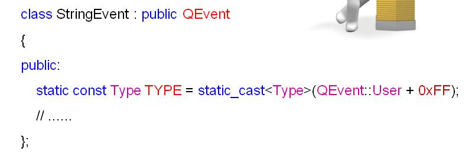
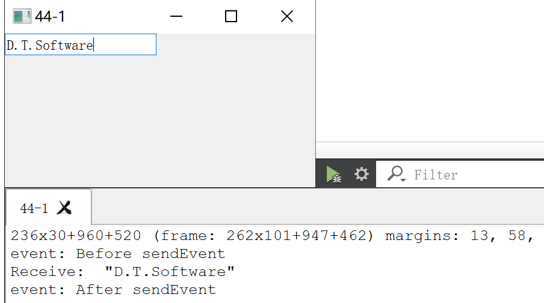

# 

## 

* 1\. Custom event object

* Qt can customize new event classes:  
--- custom event classMust inherit from`QEvent`  
--- custom event classMust have a globally unique Type value  
--- The program must provide a method to handle custom event objects
* Custom event class  
1\. Inherit QEvent as the parent class  
2\. Specify a globally unique Type value  

* Type value of Qt event:  
--- Each event class has a globally unique Type value  
--- The Type value of the custom event class also needs to be customized  
--- Use of custom event classes`Qevent::User` The following value is used as the Type value  
--- Guaranteed in the program`QEvent::User + VALUE` Globally unique
* Methods of handling custom event objects:  
1\. Install the event filter to the target object:`eventFilter()`Write custom event processing logic in the function  
2\. Rewrite the event handler function in the target object's class: in`event()`Write custom event processing logic in the function
* Why do you want to customize the event class?  
--- Need to extend the function of an existing component class  
--- Need to develop a new functional component class  
--- Need to send messages like a third-party component class

StringEvent.h
    
    #ifndef STRINGEVENT_H #define STRINGEVENT_H #include <QObject> #include <QEvent> #include <QString> class StringEvent : public QEvent { QString m_data; public: const static Type TYPE = static_cast<Type>(QEvent::User + 0xFF); StringEvent(QString data = ""); QString data(); }; #endif // STRINGEVENT_H 
    

* 1

* 2

* 3

* 4

* 5

* 6

* 7

* 8

* 9

* 10

* 11

* 12

* 13

* 14

* 15

* 16

* 17

* 18

* 19

Widget.h
    
    #ifndef WIDGET_H #define WIDGET_H #include <QWidget> #include <QLineEdit> class Widget : public QWidget { Q_OBJECT QLineEdit m_edit; public: Widget(QWidget *parent = nullptr); bool event(QEvent* e); bool eventFilter(QObject* obj, QEvent* e); ~Widget(); }; #endif // WIDGET_H 
    

* 1

* 2

* 3

* 4

* 5

* 6

* 7

* 8

* 9

* 10

* 11

* 12

* 13

* 14

* 15

* 16

* 17

* 18

main.cpp
    
    #include "Widget.h" #include <QApplication> int main(int argc, char *argv[]) { QApplication a(argc, argv); Widget w; w.show(); return a.exec(); } 
    

* 1

* 2

* 3

* 4

* 5

* 6

* 7

* 8

* 9

* 10

* 11

* 12

StringEvent.cpp
    
    #include "StringEvent.h" StringEvent::StringEvent(QString data): QEvent(TYPE) { m_data = data; } QString StringEvent::data() { return m_data; } 
    

* 1

* 2

* 3

* 4

* 5

* 6

* 7

* 8

* 9

* 10

* 11

* 12

Widget.cpp
    
    #include "Widget.h" #include "StringEvent.h" #include <QMouseEvent> #include <QApplication> #include <QDebug> Widget::Widget(QWidget *parent): QWidget(parent), m_edit(this) { m_edit.installEventFilter(this); } bool Widget::event(QEvent* e) { if(e->type() == QMouseEvent::MouseButtonDblClick) { qDebug() << "event: Before sendEvent"; StringEvent se("D.T.Software"); QApplication::sendEvent(&m_edit, &se); qDebug() << "event: After sendEvent"; } return QWidget::event(e); } bool Widget::eventFilter(QObject* obj, QEvent* e) { if((obj == &m_edit) && (e->type() == StringEvent::TYPE)) { StringEvent* se = dynamic_cast<StringEvent*>(e); qDebug() << "Receive: " << se->data(); m_edit.insert(se->data()); return true; } return QWidget::eventFilter(obj, e); } Widget::~Widget() { } 
    

* 1

* 2

* 3

* 4

* 5

* 6

* 7

* 8

* 9

* 10

* 11

* 12

* 13

* 14

* 15

* 16

* 17

* 18

* 19

* 20

* 21

* 22

* 23

* 24

* 25

* 26

* 27

* 28

* 29

* 30

* 31

* 32

* 33

* 34

* 35

* 36

* 37

* 38

* 39

* 40

* 41

summary:

* The custom event class must inherit from QEvent
* The custom event class uses the value after QEvent::User as the Type value
* The Type value of the custom event class must be globally unique
* The program needs to provide the processing method of the custom event class