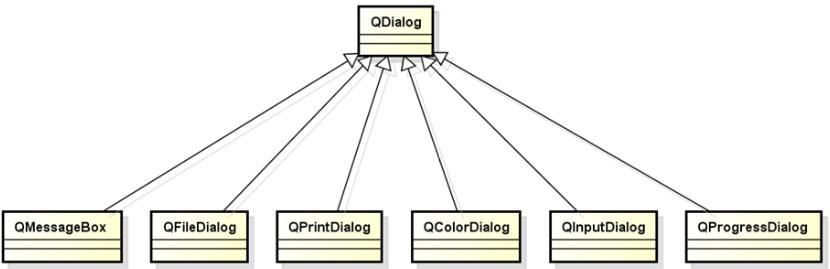

# 

## 

* ### Article Directory

* [1\. Standard dialog](https://www.programmersought.com/article/40035434589/#1__1)
* [2\. Message dialog](https://www.programmersought.com/article/40035434589/#2__28)
* [3\. File dialog](https://www.programmersought.com/article/40035434589/#3__68)
* [4\. Summary](https://www.programmersought.com/article/40035434589/#4__102)

# 1\. Standard dialog

* QT provides developers with some reusable dialog box types
* The reusable dialogs provided by QT all inherit from the QDialog class

* Standard dialogs in QT follow the same usage
    
    // Define dialog DialogType dlg(parent); // Set dialog box properties dlg.setPropertyXXX(value); // Determine the return value of the dialog box if(dlg.exec() == DialogType::value) { 	 // Get dialog box properties 	Type v = dlg.getDialogValue(); 	 // Process dialog data 	// ... } 
    

* 1

* 2

* 3

* 4

* 5

* 6

* 7

* 8

* 9

* 10

* 11

* 12

* 13

# 2\. Message dialog

* The message dialog is the most common interface element in the application
* The message dialog is mainly used for:
  * Prompt users with important information
  * Force users to make operation choices

* How to use the message dialog
    
    // Construct message dialog object QMessageBox msg(parent); // Set the relevant properties of the message dialog msg.setWindowTitle("Message Title"); msg.setText("This is message content!"); msg.setIcon(QMessageBox::Information); msg.setStandardButtons(QMessageBox::Ok | QMessageBox::Cancel); if( msg,exec() == QMessageBox::Ok) { 	 //Processing operation } 
    

* 1

* 2

* 3

* 4

* 5

* 6

* 7

* 8

* 9

* 10

* 11

* 12

* Utility functions in QMessageBox
    
    QMessageBox::question QMessageBox::information QMessageBox::warning QMessageBox::critical QMessageBox::about 
    

* 1

* 2

* 3

* 4

* 5

[QMessageBox code example address](https://github.com/164419653/QT/tree/master/19_Qt%E4%B8%AD%E7%9A%84%E6%A0%87%E5%87%86%E5%AF%B9%E8%AF%9D%E6%A1%86%E4%B8%8A/QMessageBox%E4%BB%A3%E7%A0%81%E7%A4%BA%E4%BE%8B)

# 3\. File dialog

* File dialogs are often used in the following situations
  * Open Mode: Application summary requires the user to open an external file
  * Save Mode: The current content of the application needs to be stored in an external file specified by the user
* How to use the file dialog
    
    QFileDialog fd(parent); // save mode: QFileDialog::AcceptOpen fd.setAcceptMode(QFileDialog::AcceptOpen); // multi-selecion: QFileDialog::ExistingFiles fd.setFileMode(QFileDialog::ExistingFile); if( fd.exec() == QFileDialog::Accepted ) { 	QStringList fs = fd.selectedFiles(); 	// process variable fs } 
    

* 1

* 2

* 3

* 4

* 5

* 6

* 7

* 8

* 9

* 10

* 11

* You can use file filters to filter file types
* Utility functions in QFileDialog
    
    QFileDialog::getOpenFileName QFileDialog::getOpenFileNames QFileDialog::getSaveFileNames 
    

* 1

* 2

* 3

[QFileDialog code demo example](https://github.com/164419653/QT/tree/master/19_Qt%E4%B8%AD%E7%9A%84%E6%A0%87%E5%87%86%E5%AF%B9%E8%AF%9D%E6%A1%86%E4%B8%8A/QFileDialog%E4%BB%A3%E7%A0%81%E7%A4%BA%E4%BE%8B)

# 4\. Summary

* QT provides multiple reusable dialog box types, inherited from the QDialog type, following the same usage
* QMessageBox is used to prompt important program information
* QFileDialog is used to obtain the file path in the system